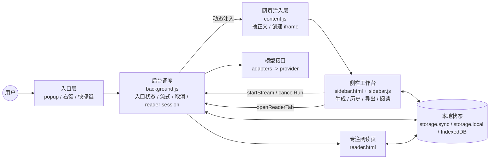
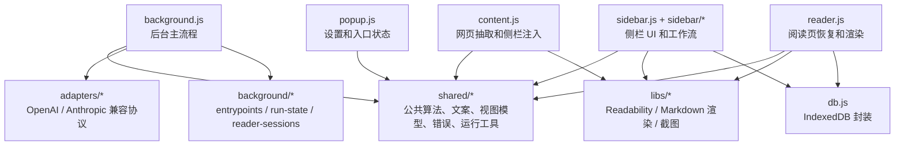
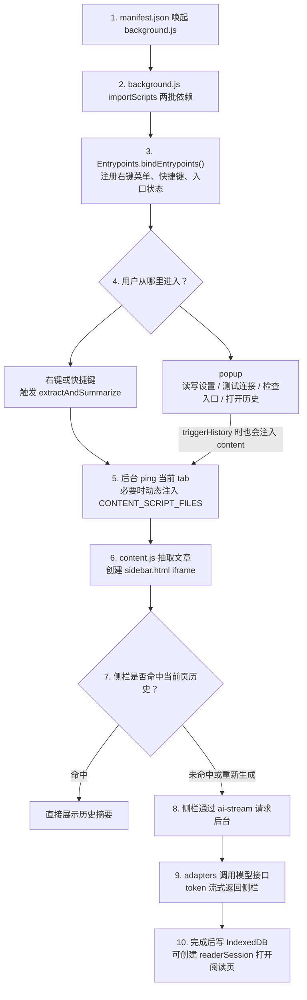

# 技术架构

Last updated: 2026-05-01

这份文档描述当前仓库已经落地并仍然有效的运行时边界、数据模型，以及支撑重构的工程验证边界。TypeScript、构建链和 Preact 迁移属于规划草案，见 [TypeScript + Preact 迁移设计](TS_PREACT_MIGRATION.md)。

## 运行时总览

当前主链路如下：

1. `popup.html / popup.js` 负责设置页 UI、标签切换、自动保存、连接测试和入口状态检查。
2. `content.js` 在网页中抽取正文和元信息，并注入侧栏容器。
3. `shared/article-utils.js` 把抽取结果标准化为文章快照，并根据长度决定是否分段。
4. `shared/page-strategy.js` 基于页面类型给出页面策略和推荐摘要模式。
5. `sidebar/state.js` 负责侧栏初始状态、导航策略常量和 DOM 元素绑定；`sidebar.js` 负责侧栏编排、收藏和诊断展示；历史面板由 `sidebar/history.js` 管理，Markdown 导出和分享卡由 `sidebar/export.js` 管理，阅读页快照和打开由 `sidebar/reader-session.js` 管理，主摘要、二次生成、取消和流式连接由 `sidebar/generation.js` 管理，摘要模式控件由 `sidebar/mode-control.js` 管理，按钮、键盘和入口消息事件由 `sidebar/events.js` 管理。
6. `background.js` 通过 `adapters/` 执行请求，统一处理流式、取消、重试和错误；右键菜单、快捷键和入口状态由 `background/entrypoints.js` 管理，运行状态表和 port-run 映射由 `background/run-state.js` 管理，阅读页临时会话由 `background/reader-sessions.js` 管理。
7. `db.js` 把结构化结果保存到 IndexedDB，并提供搜索、收藏、删除和站点聚合能力。
8. `reader.html / reader.js` 从临时阅读会话中恢复当前摘要，在新标签页提供专注阅读体验。

## 架构与依赖图

这三张图按阅读目的拆开：第一张看整体，第二张看代码依赖边界，第三张看启动和一次摘要的顺序。

### 1. 一眼看懂版

核心心智模型：入口只负责触发，`content.js` 只负责拿网页内容和挂侧栏，侧栏负责用户可见工作流，后台负责模型请求、取消和跨页面状态，存储负责设置、历史和阅读会话。

### 2. 代码依赖边界

依赖约束：provider 逻辑只进 `adapters/`；右键、快捷键和入口状态只进 `background/entrypoints.js`；运行取消和 port-run 映射只进 `background/run-state.js`；历史记录读写统一走 `db.js`。

### 3. 启动和一次摘要顺序

## 工程验证边界

运行时代码之外，当前仓库已经有两层验证护栏：

### 1. `tests/` Node 层

职责：

- 覆盖纯逻辑和工具函数。
- 覆盖记录存储、搜索、收藏、删除、复用等存储行为。
- 覆盖 Manifest、HTML DOM、脚本顺序、消息 action 等静态契约。
- 用 `tests/feature-matrix.js` 维护既有功能覆盖清单。

关键文件：

- `tests/harness.js`
- `tests/feature-matrix.js`
- `tests/unit-core.test.js`
- `tests/unit-adapters-transport.test.js`
- `tests/unit-record-store.test.js`
- `tests/static-contracts.test.js`
- `tests/fake-indexeddb.js`

### 2. `e2e/` Playwright 层

职责：

- 在真实 Chromium 中加载当前扩展目录。
- 验证 popup、content script、background service worker、sidebar iframe、reader 页面之间的真实协作。
- 通过本地 fixture 页面和 mock AI 接口回归高价值主链路。

关键文件：

- `playwright.config.js`
- `e2e/test-server.js`
- `e2e/extension-harness.js`
- `e2e/extension.spec.js`

职责分工：

- Node 层跑得快，适合纯逻辑、存储和静态契约。
- Playwright 层更接近真实用户路径，但不追求 provider 全排列和全部视觉细节。

### 3. TypeScript 契约层

职责：

- 通过 `npm run typecheck` 执行 `tsc --noEmit`，只做类型和契约检查，不生成运行产物。
- 用 `types/messages.ts`、`types/history.ts`、`types/settings.ts`、`types/diagnostics.ts` 锁定消息协议、记录结构、设置项和运行诊断字段。
- 当前仍保持无构建、纯脚本结构，类型文件不进入 Manifest 或 HTML 脚本加载列表。

## 主要模块

### `manifest.json`

定义扩展形态和权限边界：

- `manifest_version: 3`
- service worker: `background.js`，保持 classic service worker，并通过 `importScripts` 显式加载依赖
- popup: `popup.html`
- content script: 当前不在 Manifest 中声明 `content_scripts`；右键菜单、快捷键或 popup 历史入口触发时，`background.js` 通过 `chrome.scripting.executeScript` 动态注入 `CONTENT_SCRIPT_FILES`
- 权限：`contextMenus`、`storage`、`activeTab`、`scripting`、`clipboardWrite`
- `host_permissions: <all_urls>`
- `web_accessible_resources` 暴露侧栏运行所需的 HTML、样式、共享脚本和第三方库

当前 Manifest 仍直接引用根目录 service worker、popup HTML 和 web accessible resources；动态 content 注入列表维护在 `background.js` 的 `CONTENT_SCRIPT_FILES`。未来如果引入 `dist/` 构建产物，需要同步更新 Playwright 加载目录、静态契约测试和文档入口。

### `popup.html / popup.js`

职责：

- 渲染设置页三个标签：`连接`、`偏好`、`入口`
- 自动保存设置
- 测试连接
- 打开当前页历史
- 配置入口是否优先复用本页历史摘要
- 检查右键菜单 / 快捷键状态
- 打开浏览器快捷键设置页

自动保存策略：

- 文本输入走 debounce + `blur` 立即保存
- 复选框和下拉框走 immediate save
- `visibilitychange` 和 `pagehide` 时 flush 未完成改动

### `content.js`

职责：

- 从当前网页读取 DOM、meta 信息和 Readability 结果
- 构建文章快照输入
- 注入侧栏容器和资源
- 在入口触发时把数据发给侧栏
- 跟踪 same-document navigation，并在已有侧栏打开时刷新页面上下文

说明：

- `content.js` 使用 `libs/readability.js` 这个 vendored 的外部库做正文抽取。
- `readability.js` 属于第三方依赖，不是项目自研模块。
- 右键、快捷键和 popup 等显式入口仍通过 `injectSidebar()` 打开或重建侧栏。
- SPA / 同文档路由切换不会重建 iframe；`content.js` 会向现有 iframe `postMessage` 发送 `articleData`，并带上 `source: 'navigation'` 与内部 `navigationPolicy`。

### `sidebar.html / sidebar.js / style.css`

职责：

- 渲染主要工作台
- 展示来源信息和可信与控制状态
- 处理主摘要和二次生成
- 在入口触发时优先复用当前页面的历史摘要，并保留当前页上下文用于重新生成
- 维护历史 / 收藏面板
- 导出 Markdown
- 生成长截图分享卡
- 打开新标签页阅读器
- 展示运行诊断

SPA 路由切换的当前默认策略：

- `navigationPolicy.autoStartOnNavigation` 默认为 `false`，所以导航刷新只更新上下文，不自动发起模型请求。
- `navigationPolicy.duringGeneration` 默认为 `defer`，所以生成中收到导航刷新时，只保存最新 pending payload，不取消旧 run，也不断开 stream port。
- 旧 run 进入 `finally` 后，侧栏会应用最新 pending navigation：更新 meta，优先复用新页面历史；未命中历史时显示等待手动“重新生成”的占位态。
- 内部预留 `defer`、`replace`、`ignore` 三种运行中导航策略。当前没有暴露用户设置，也没有改变 `chrome.storage` schema 或 Manifest 权限。

`sidebar/state.js` 负责侧栏状态和 DOM 绑定边界：

- `SETTINGS_KEYS`、`NAVIGATION_DURING_GENERATION` 和 `DEFAULT_NAVIGATION_POLICY` 集中在该模块，避免 `sidebar.js` 顶部继续膨胀。
- `createInitialState({ trust })` 每次创建新的状态对象、`Set`、设置快照和 trust policy。
- `resolveElements(documentRef)` 维护侧栏 DOM id 到元素键名的映射，`sidebar.js` 只持有返回后的 `elements`。

`sidebar/export.js` 负责侧栏导出边界：

- Markdown 文件导出和安全文件名清理。
- 分享卡摘录、分享卡 DOM 构建和 `html2canvas` 长图生成。
- 通过 `createExportController(deps)` 接收 `sidebar.js` 注入的状态、元素、格式化、Markdown 净化和状态提示能力。

`sidebar/reader-session.js` 负责侧栏阅读页会话边界：

- 基于当前文章、可见记录、摘要、模式和诊断构建 reader snapshot。
- 通过既有 `openReaderTab` runtime message 打开独立阅读页。
- 通过 `createReaderSessionController(deps)` 接收 `sidebar.js` 注入的状态、元素、snapshot builder、runtime message 和状态提示能力。

`sidebar/generation.js` 负责侧栏生成运行边界：

- 主摘要、长文分段汇总、二次生成、stream port 和取消控制。
- active runId、当前 port 和 `AbortController` 仍由 `sidebar.js` 的状态对象承载，但只能通过 `createGenerationController(deps)` 注入访问。
- 保持 `startStream` / `cancelRun` runtime message 和 provider prompt 行为不变。

`sidebar/mode-control.js` 负责侧栏摘要模式控件边界：

- 摘要模式选项初始化、合法值兜底、菜单开关、active 状态同步和控件内事件绑定。
- 保持原生 `<select>` 与自定义菜单同步，`sidebar.js` 只读取当前 `summaryModeSelect.value` 并通过 controller 设置值或关闭菜单。

`sidebar/events.js` 负责侧栏事件绑定边界：

- 绑定主要按钮、二次生成按钮、summary 滚动、`window.message` 入口和全局 `Escape` 关闭顺序。
- 通过 `createEventsController(deps)` 接收 `sidebar.js` 注入的业务动作，事件模块不直接拥有生成、历史、导出、阅读或设置逻辑。

### `reader.html / reader.js`

职责：

- 从 `chrome.storage.local` 读取阅读会话快照
- 必要时回查 IndexedDB 记录
- 展示独立阅读布局
- 提供“打开原文”和“复制 Markdown”操作

阅读页不是默认主工作区，而是侧栏之外的补充阅读路径。

### `background.js`

职责：

- provider 适配器解析与请求执行
- 流式输出和取消控制编排
- 统一错误归一化
- 连接测试
- 委托入口模块维护右键菜单和快捷键状态
- 委托入口模块打开快捷键设置页
- 委托阅读会话模块创建独立阅读页会话并打开 `reader.html`

`background/entrypoints.js` 负责扩展入口边界：

- 注册右键菜单并记录 context menu 状态。
- 检查 `trigger-summary` 快捷键状态并记录冲突提示。
- 绑定 context menu / command 事件到后台传入的页面触发函数。
- 打开浏览器快捷键设置页。

`background/run-state.js` 负责后台运行状态边界：

- 维护 active runs 和 stream port 到 run 的映射
- 绑定当前请求的 `AbortController`
- 处理单个 run 取消、port 断开批量取消和 run 结束清理

`background/reader-sessions.js` 负责独立阅读页临时会话：

- 清理过期的 `readerSession:` storage.local 记录。
- 为 `openReaderTab` 创建 24 小时有效的 reader session snapshot。
- 保持 reader 会话与后台运行状态解耦。

主要消息入口：

- `testConnection`
- `runPrompt`
- `cancelRun`
- `triggerHistory`
- `getEntrypointStatus`
- `openShortcutSettings`
- `openReaderTab`

### `db.js`

职责：

- 打开 IndexedDB
- 维护 `summaryRecords` store
- 兼容旧 `history` store 迁移
- 记录标准化
- 按 articleId / URL 匹配当前页面可复用的历史记录
- 搜索、收藏、删除、站点聚合

当前关键状态：

- `DB_VERSION = 2`
- 主 store：`summaryRecords`
- 旧 store：`history`

### `shared/`

按“工具边界清晰、复用逻辑集中”的方式组织：

- `domain.js`：URL 归一化、ID / hash、站点识别
- `strings.js`：摘要模式、页面类型标签、状态文案
- `page-strategy.js`：页面类型到策略和推荐模式的映射
- `article-utils.js`：文章快照构建、分段、prompt 生成
- `trust-policy.js`：无痕和默认策略归一化
- `provider-presets.js`：厂商 preset、Provider / Endpoint Mode 默认值
- `theme.js`：popup、侧栏、阅读页的主题同步
- `ui-format.js`：popup、侧栏、阅读页共用的 HTML 转义和时间显示工具
- `ui-labels.js`：popup、侧栏、阅读页共用的 provider、摘要模式、记录状态、策略和 warning 显示文案
- `summary-text.js`：存储层、侧栏、阅读页共用的 Markdown 转纯文本、摘要预览截断和 bullet 提取工具
- `diagnostics-view.js`：侧栏共用的运行诊断与取消态视图推导工具，负责 partial summary、toggle 文案和取消态 facts 组装
- `reader-view.js`：侧栏与阅读页共用的阅读快照投影工具，负责会话快照构建、记录合并和外链规范化
- `history-view.js`：侧栏历史面板共用的展示数据组装工具，负责历史项与站点分组的纯视图模型
- `sidebar-meta-view.js`：侧栏文章信息与 trust card 共用的展示数据组装工具，负责 meta 文案、warnings 和 trust badge/tone 推导
- `errors.js`：统一错误模型
- `abort-utils.js`：取消控制工具
- `run-utils.js`：运行终态、取消说明、诊断摘要
- `transport-utils.js`：SSE / raw body 解析与传输层辅助工具

### `adapters/`

provider-specific 逻辑集中在这里，而不是散落在 `background.js`：

- `openai-adapter.js`
- `anthropic-adapter.js`
- `registry.js`

当前支持的接口族：

- OpenAI Compatible `responses`
- OpenAI Compatible `chat_completions`
- OpenAI Compatible `legacy_completions`
- Anthropic `messages`

## 数据模型

### 1. 文章快照

文章快照是一次页面抽取后的标准化结果，主要包含：

- 来源：`sourceUrl`、`normalizedUrl`、`sourceHost`、`siteName`
- 元信息：`title`、`author`、`publishedAt`、`language`
- 内容：`rawText`、`cleanText`、`content`、`contentLength`
- 页面理解：`sourceType`、`sourceStrategy`、`preferredSummaryMode`
- 长文信息：`chunkingStrategy`、`chunkCount`、`chunks`
- 可信边界：`allowHistory`、`allowShare`
- 质量信号：`warnings`、`qualityScore`、`diagnostics`

### 2. 运行时适配器快照

每次请求都会快照当前适配器配置，至少包括：

- `provider`
- `adapterId`
- `endpointMode`
- `model`
- `baseUrl`

这些字段会进入结果记录，避免历史因后续设置变化而失真。

### 3. 总结记录

历史记录是结构化对象，而不是简单字符串列表。当前记录至少包含：

- 身份：`recordId`、`articleId`、`runId`
- 来源快照：URL、标题、站点、文章快照
- 请求快照：摘要模式、目标语言、prompt 配置
- 模型快照：provider、adapter、endpoint、model
- 状态：`status`、`retryCount`、`durationMs`、错误信息、诊断
- 输出：`summaryMarkdown`、`summaryPlainText`
- 组织信息：`favorite`、`dedupeKey`
- 可信边界：`privacyMode`、`allowHistory`、`allowShare`

### 4. 阅读会话

独立阅读页使用临时阅读会话，而不是直接依赖侧栏状态：

- 存在 `chrome.storage.local`
- key 前缀：`readerSession:`
- 默认保留 24 小时
- 优先读取侧栏传入的快照
- 如果记录允许落库，再尝试回查 IndexedDB 获得最新内容

这样即使当前结果未写入历史，也能打开独立阅读页。

## 存储边界

### `chrome.storage.sync`

保存用户设置，例如：

- API Key
- 厂商预设、Provider、Endpoint Mode
- Base URL、模型名称、额外系统要求
- 自动翻译、默认输出语言
- 主题偏好
- 无痕模式、默认写入历史、默认允许分享
- 入口自动生成、入口默认简短总结、入口优先显示本页历史摘要

### `chrome.storage.local`

保存本地运行时状态：

- 右键菜单 / 快捷键状态
- 最近触发信息
- 阅读页临时会话

### IndexedDB

保存历史记录：

- 数据库：`AISummaryDB`
- 版本：`2`
- store：`summaryRecords`
- 保留旧 `history` store 用于迁移兼容

## 稳定边界

当前有几个边界不应再被打散：

- provider 逻辑继续收敛在 `adapters/`，不要回到 `background.js` 里堆分支。
- 右键菜单、快捷键和入口状态继续收敛在 `background/entrypoints.js`。
- 可信策略继续收敛在 `shared/trust-policy.js`，不要在 UI 层各自拼判断。
- 历史记录始终以结构化对象保存，不退回到简单字符串列表。
- 阅读页继续作为侧栏之外的补充阅读能力，而不是替代侧栏主工作流。
- 后台 reader session 创建和过期清理继续收敛在 `background/reader-sessions.js`。
- 验证体系保持 `Node 契约` 与 `Playwright 主链路` 分层，不拿其中一层去替代另一层。
- 当前运行产物仍是无构建、纯脚本结构；如引入 TypeScript、构建链或 Preact，必须按专项迁移设计分阶段验证。
